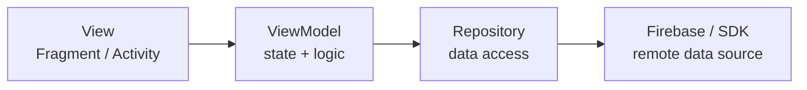
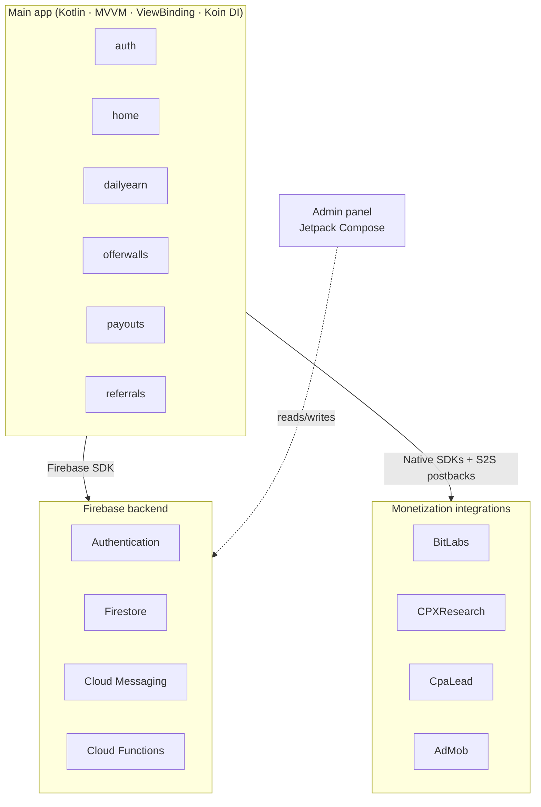

# VidEarn — Android Rewards App

A self-built, self-published Android application that rewarded users for completing surveys and watching ads. Built and operated solo from January 2023 to April 2025, reaching over 12,600 active users across 174 countries before being sunsetted.

> Designed, developed, published, and operated entirely by one person — from product architecture to monetization integration to payout processing.

---

## Numbers

| Metric | Value |
|---|---|
| Active users (Firebase Analytics) | 12,600+ |
| Registered accounts | 10,300+ |
| Countries reached | 174 |
| Production releases | 51 (v1.0 → v2.3.3) |
| Active period | Jan 2023 – Apr 2025 |

---

## Architecture

The project is a multi-module Android codebase structured around feature-based MVVM, where each domain area owns its full stack from UI to data layer.

```
VidEarn_v2.3.3/
├── app/                     # Main user-facing application
│   └── java/.../
│       ├── auth/            # Sign-up, sign-in, email verification, password reset
│       ├── home/            # Dashboard and navigation
│       ├── dailyearn/       # Daily bonus and spin wheel
│       ├── offerwalls/      # Survey and offer integrations
│       ├── payouts/         # Crypto and gift card redemption
│       ├── referrals/       # Referral tracking and rewards
│       ├── fcm/             # Push notification handling
│       └── shared/          # Base classes and utilities
├── admin/                   # Separate admin panel app (Jetpack Compose)
├── wheelSpin/               # Custom spin wheel library module
└── KiwiSDK/                 # Custom internal SDK module
```

Each feature follows a strict three-layer structure — no Views touching Firebase directly:



The admin panel is a separate app module written in Jetpack Compose, reflecting an evolution in tooling over the project's lifetime.

### System overview



---

## Tech stack

| Area | Technology |
|---|---|
| Language | Kotlin |
| Architecture | MVVM — ViewModel + Repository pattern |
| UI | XML Views + ViewBinding |
| Admin UI | Jetpack Compose |
| Navigation | Navigation Components |
| DI | Koin |
| Auth | Firebase Authentication |
| Database | Firebase Firestore |
| Push notifications | Firebase Cloud Messaging (FCM) |
| In-app updates | Google Play App Update API |
| Async | Kotlin Coroutines |
| Build | Gradle · compileSdk 34 · minSdk 23 (Android 6.0+) |

---

## Monetization integrations

| Provider | Type | Integration |
|---|---|---|
| BitLabs | Survey offerwall | Native Android SDK |
| CPXResearch | Survey offerwall | Native Android SDK |
| CpaLead | Offerwall | WebView + S2S postbacks |
| Google AdMob | Display ads | SDK |
| Crypto payouts | BTC, USDT | Custom payout flow |
| Gift cards | Amazon, Google Play, etc. | Custom payout flow |

S2S (server-to-server) postbacks were implemented to validate reward events from providers before crediting user balances — a real-world integration pattern, not just SDK calls.

---

## Screenshots

| Home | Offerwalls | Spin wheel | Payouts |
|---|---|---|---|
|  |  |  |  |

---

## Status

**Sunsetted — April 2025.**

After 2+ years of operation, the app was taken down from the Play Store due to SDK instability and monetization challenges that made continued maintenance unsustainable. The codebase represents the state at v2.3.3, build 51.

---

*Solo project — designed, built, and operated by Imad El Murr, 2023–2025.*
