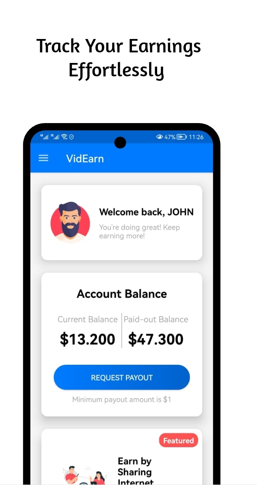
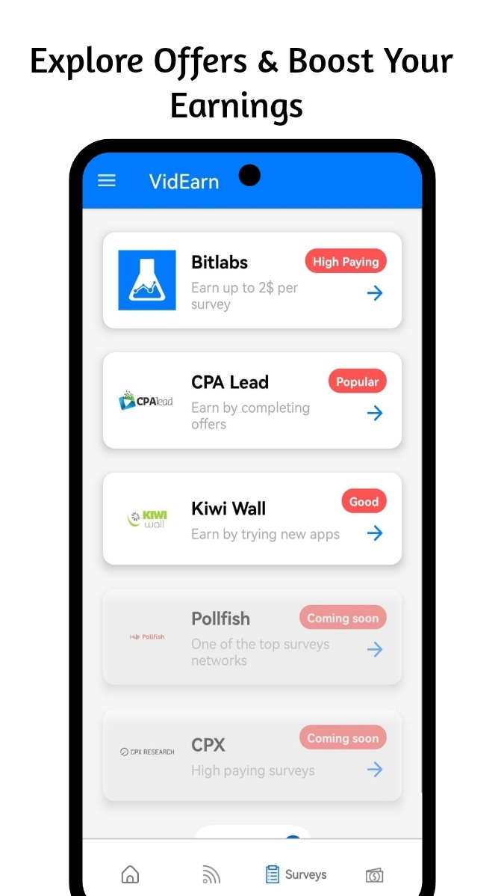
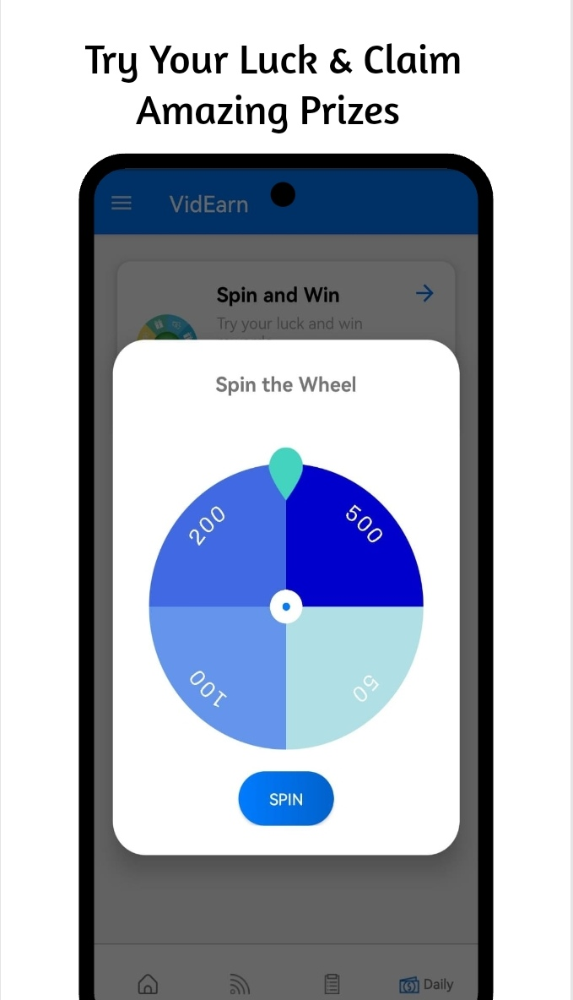
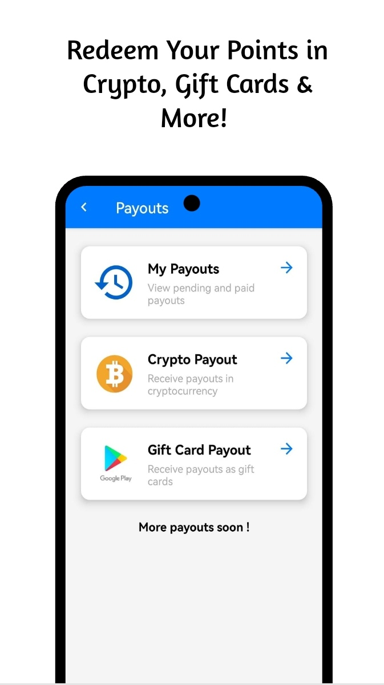

# VidEarn — Android Rewards App

A self-built, self-published Android application that rewarded users for completing surveys, watching ads, and sharing bandwidth. Launched in January 2023, reached **12,600+ active users across 174 countries**, and operated for over 2 years before being sunsetted in April 2025.

> Built solo from scratch — product design, development, monetization integration, backend, and operations.

---

## Highlights

- **12,600+ active users** across **174 countries** (Firebase Analytics)
- **10,300+ registered accounts** (Firebase Auth)
- **51 production releases** over 2+ years of active development (v1.0 → v2.3.3)
- **Multiple live monetization integrations** generating real payouts to users
- Separate **admin panel app** for managing users, payouts, and notifications

---

## Architecture

Multi-module Android project following **MVVM** with clean package separation:

```
app/                        # Main user-facing app
├── auth/                   # Sign in, sign up, email verification, password reset
├── home/                   # Dashboard
├── offerwalls/             # Surveys & offer integrations (BitLabs, CPXResearch, CpaLead)
├── dailyearn/              # Daily bonus + spin wheel
├── internetsharing/        # Bandwidth monetization (Pawns SDK)
├── payouts/                # Crypto (BTC/USDT) + gift card redemption
├── referrals/              # Referral tracking
├── fcm/                    # Push notifications
└── shared/                 # Base classes, utilities

admin/                      # Separate admin panel (Jetpack Compose)
├── Users management
├── Payout processing & approval
├── Task management
└── Notification broadcasting

wheelSpin/                  # Custom spin wheel library module (Java)
KiwiSDK/                    # Custom internal SDK module
```

---

## Tech Stack

| Area | Technology |
|---|---|
| Language | Kotlin |
| Architecture | MVVM (ViewModel + Repository pattern) |
| UI | XML Views + ViewBinding + Navigation Components |
| Admin UI | Jetpack Compose |
| Auth | Firebase Authentication |
| Database | Firebase Firestore |
| Push | Firebase Cloud Messaging (FCM) |
| DI | Koin |
| Networking | OkHttp |
| In-app updates | Google Play App Update API |
| Build | Gradle, targetSdk 34, minSdk 23 |

---

## Monetization Integrations

| Provider | Type | Integration method |
|---|---|---|
| BitLabs | Surveys / offerwall | Native Android SDK |
| CPXResearch | Surveys | Native Android SDK |
| CpaLead | Offerwall | WebView + S2S postbacks |
| Pawns App | Bandwidth sharing | Native Android SDK |
| Google AdMob | Display ads | SDK |
| Crypto payouts | BTC, USDT | Custom payout flow |
| Gift cards | Amazon, Google Play, etc. | Custom payout flow |

S2S (server-to-server) postbacks were implemented to validate reward events from providers before crediting user balances.

---

## User Geography (top countries by active users)

| Country | Active users |
|---|---|
| United States | 2,284 |
| India | 1,299 |
| Egypt | 606 |
| Pakistan | 546 |
| Nigeria | 475 |
| Kenya | 417 |
| United Kingdom | 365 |
| South Africa | 341 |

Full coverage across 174 countries.

---

## Status

**Sunsetted — April 2025.**

After 2+ years of operation, growing monetization challenges (ad fill rate drops, SDK instability, profitability constraints) made continued maintenance unsustainable. The app was taken down from the Play Store in April 2025.

The codebase represents the state at **v2.3.3** (build 51).

---

## Screenshots

| Home | Offerwalls | Spin Wheel | Payouts |
|---|---|---|---|
|  |  |  |  |

---

*Solo project — designed, built, and operated by Imad El Murr, 2023–2025.*